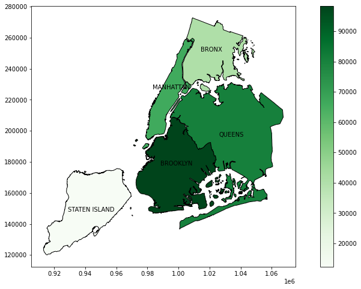
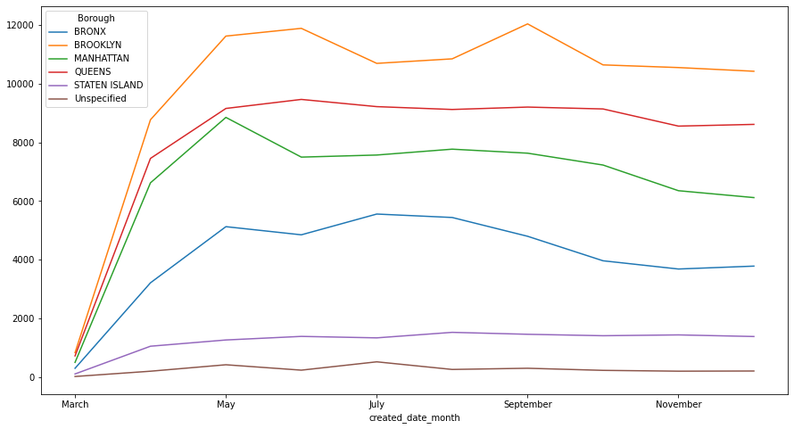

# NYC311 - Customer Service Requests Analysis

## DESCRIPTION

**Background of Problem Statement :**

NYC 311's mission is to provide the public with quick and easy access to all New York City government services and information while offering the best customer service. Each day, NYC311 receives thousands of requests related to several hundred types of non-emergency services, including noise complaints, plumbing issues, and illegally parked cars. These requests are received by NYC311 and forwarded to the relevant agencies such as the police, buildings, or transportation. The agency responds to the request, addresses it, and then closes it.

**Problem Objective :**

Perform a service request data analysis of New York City 311 calls. 

## DATASET EXPLORATION & DATA WRANGLING 
The 311 dataset spans from March-2015 to December-2015, i.e., 277 days. Moreover, the following explores more about the dataset:
- The orignal dataset has 300,698 rows and 53 columns `df.shape`
- Data type of `columns=['Created Date' ,'Closed Date','Due Date','Resolution Action Updated Date']`  was changed to **datetime**, to easily work with datetime in pandas 
- Used `df.isna().sum()` to determine the missing values in each column. `df.info()` also provides the Non-Null Count and datatype for each column. Dropped the following columns with no data. The new dataset is 300698 rows and 41 columns
```Python
drop_columns=["Landmark","School or Citywide Complaint","Vehicle Type","Taxi Company Borough"
             ,"Taxi Pick Up Location","Bridge Highway Name","Bridge Highway Direction",
             "Road Ramp","Bridge Highway Segment","Garage Lot Name","Ferry Direction",
             "Ferry Terminal Name"]
```

- Find and replace NYPD to New York City Police Department in the Agenct Name column. 
- Merged the geopandas NYC Burough geometry with the orignal dataset to get the burough multipolygon geometry

## DATA ANALYSIS & INSIGHT
The following insights were gathered from the dataset:
- Number of records by Complaint Type. 
The following table tells us that blocked driveway, illegal parking, noise (street, commercial & vehicle) are amongst the highest complaint type received by 311  

 Complaint Type            |   count |
|:--------------------------|--------:|
| Blocked Driveway          |   77044 |
| Illegal Parking           |   75361 |
| Noise - Street/Sidewalk   |   48612 |
| Noise - Commercial        |   35577 |
| Derelict Vehicle          |   17718 |
| Noise - Vehicle           |   17083 |
| Animal Abuse              |    7778 |
| Traffic                   |    4498 |
| Homeless Encampment       |    4416 |
| Noise - Park              |    4042 |
| Vending                   |    3802 |
| Drinking                  |    1280 |
| Noise - House of Worship  |     931 |
| Posting Advertisement     |     650 |
| Urinating in Public       |     592 |
| Bike/Roller/Skate Chronic |     427 |
| Panhandling               |     307 |
| Disorderly Youth          |     286 |
| Illegal Fireworks         |     168 |
| Graffiti                  |     113 |
| Agency Issues             |       6 |
| Squeegee                  |       4 |
| Ferry Complaint           |       2 |
| Animal in a Park          |       1 |

- Number of records by Status & Complaint Type
- Number of records/tickets by Burough
The highest number of requests came from Brooklyn 

| Borough       |   count |
|:--------------|--------:|
| BROOKLYN      |   98307 |
| QUEENS        |   80641 |
| MANHATTAN     |   66131 |
| BRONX         |   40702 |
| STATEN ISLAND |   12343 |
| Unspecified   |    2574 |

The following is a heatmap


- Number of tickets by month and Burough (line graph)
On the month over month ticket request trend, we notice that Summer and Fall seasons are were most tickets are raised for Brooklyn. Can be because of tourist influx in summer and school starting in the fall season. Also note that, this is counterintuitive, as one would lead to think that Manhattan, being the tourist center, should have the most tickets. However, Brooklyn is the most populous burough in NYC, therefore 311 is saying a lot of tickets from Brooklyn



- Avg response time by Complaint Type and  Location Type
response time is defined as 
```python
df['Request_Closing_Time']=df['Closed Date'] - df['Created Date']
```
- Avg response time by Borough and Complaint Type


## PYTHON LIBRARIES
- Pandas
- Numpy
- geopandas
- contextiy

